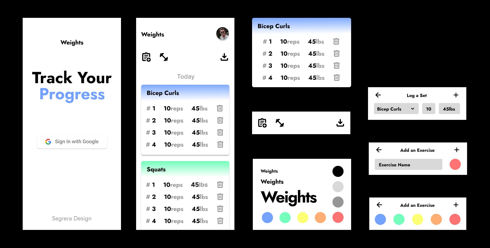

# Weights

A workout logging web application  
Created for my personal use and to test out my full-stack skills  
Uses a Pocketbase + React stack that enables quick development

[Live Preview](https://weights.sergiosegrera.com)

## Functionality

- Login / Create an account
- Create exercises and categorize them by color
- Log sets
- Download all sets as CSV

## Wireframes

## How to run locally

`$ git clone https://github.com/sergiosegrera/weights && cd weights`  
`$ docker build -t weights .`  
`$ docker run -p 8090:8090 weights`

After that, login into the admin portal at `localhost:8090/_/` and set up Google OAuth2

## TODO

- Better homepage
- Pagination / Infinite scrolling
- Animations
